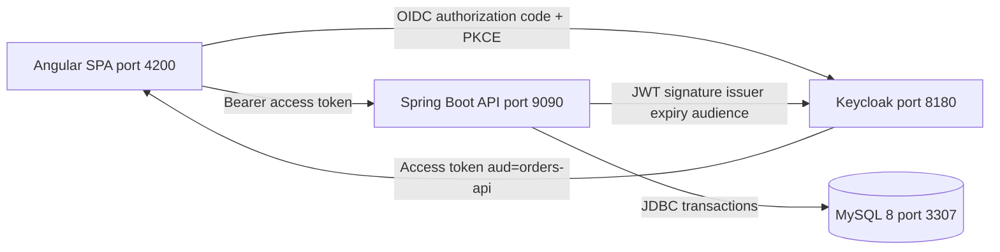

# Runtime flow

```mermaid
flowchart LR
    Browser[Angular SPA port 4200] -->|OIDC authorization code + PKCE| Keycloak[Keycloak port 8180]
    Keycloak -->|Access token aud=orders-api| Browser
    Browser -->|Bearer access token| API[Spring Boot API port 9090]
    API -->|JWT signature issuer expiry audience| Keycloak
    API -->|JDBC transactions| MySQL[(MySQL 8 port 3307)]
```

Security checks are independent: browser OIDC login does not substitute for backend JWT validation or per-order ownership checks.
